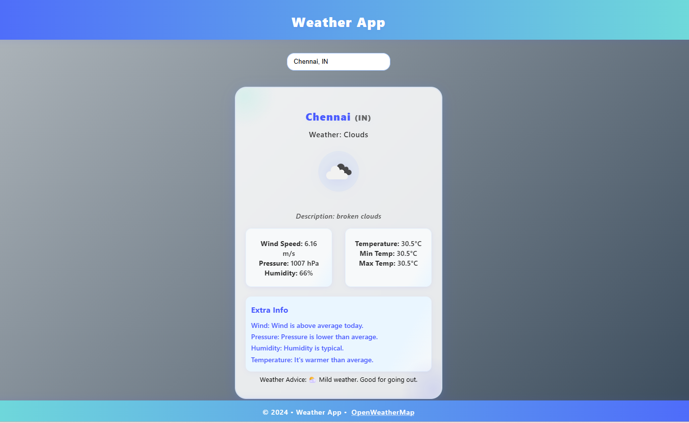

# Weather App



A modern, responsive weather application built with **Python Flask** and **OpenWeatherMap API**.  
Features real-time city search with suggestions, beautiful UI, and smart weather advice.

---

## 🌟 Features

- **Real-time city search** with dropdown suggestions
- **Current weather** for any city worldwide
- **Weather advice** (e.g., "Carry an umbrella", "Great weather to go out")
- **Extra info**: wind, pressure, humidity, temperature with context
- **Aesthetic, responsive UI** with glassmorphism and gradient backgrounds
- **Mobile-friendly** and desktop-optimized

---

## 🚀 Technologies Used

- **Python 3**
- **Flask** (backend web framework)
- **Requests** (for API calls)
- **python-dotenv** (for environment variables)
- **HTML5 & CSS3** (modern, responsive design)
- **JavaScript** (frontend interactivity)
- **OpenWeatherMap API** (weather data)

---

## 📦 Setup & Run

1. **Clone the repository**
   ```sh
   git clone https://github.com/yourusername/Weather_App.git
   cd Weather_App
   ```

2. **Install dependencies**
   ```sh
   pip install -r requirements.txt
   ```

3. **Set up your `.env` file**
   ```
   OPEN_WEATHER_API_KEY=your_openweathermap_api_key
   ```

4. **Run the app**
   ```sh
   python app.py
   ```
   Visit [http://localhost:5000](http://localhost:5000) in your browser.

---

## 📷 Screenshots


---

## 🙏 Credits

- [OpenWeatherMap](https://openweathermap.org/) for weather data
- UI inspired by modern glassmorphism and gradient design trends

---
